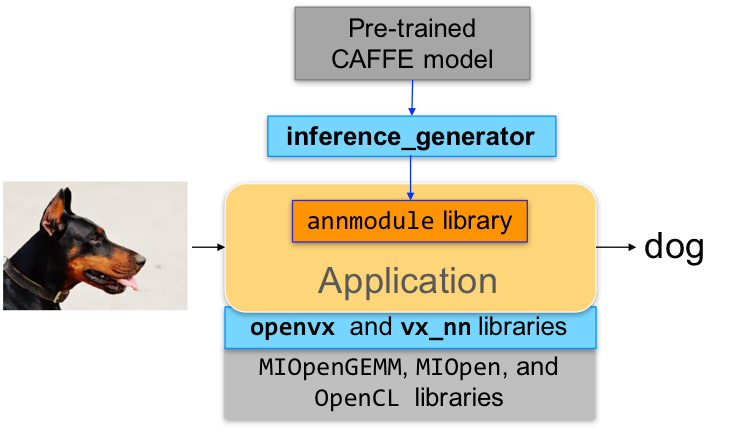
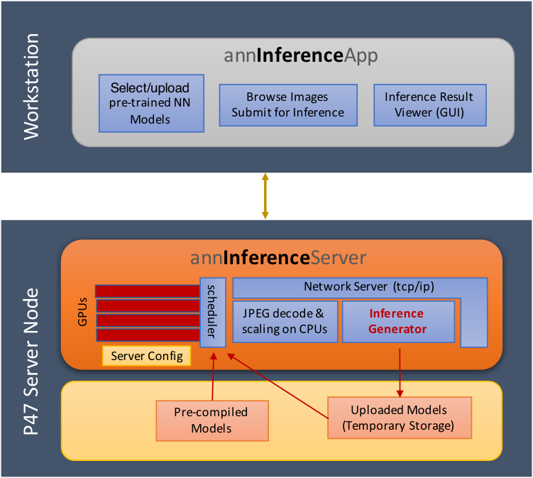

# AMD OpenVX modules (amdovx-modules)
The OpenVX framework provides a mechanism to add new vision functions to OpenVX by 3rd party vendors. This project has below OpenVX modules and utilities to extend [amdovx-core](https://github.com/GPUOpen-ProfessionalCompute-Libraries/amdovx-core) project, which contains the AMD OpenVX Core Engine.
* [vx_nn](vx_nn/README.md): OpenVX neural network module
* [model_compiler](utils/model_compiler/README.md): generate efficient inference library from pre-trained models (such as ONNX)
* [inference_generator](utils/inference_generator/README.md): generate inference library from pre-trained CAFFE models
* [annInferenceServer](utils/annInferenceServer/README.md): sample Inference Server
* [annInferenceApp](utils/annInferenceApp/README.md): sample Inference Client Application
* [vx_loomsl](vx_loomsl/README.md): Radeon LOOM stitching library for live 360 degree video applications
* [loom_shell](utils/loom_shell/README.md): an interpreter to prototype 360 degree video stitching applications using a script
* [vx_opencv](vx_opencv/README.md): OpenVX module that implemented a mechanism to access OpenCV functionality as OpenVX kernels

If you're interested in Neural Network Inference, start with the sample inference application.

Inference Application Development Workflow |  Sample Inference Application
:-------------------------:|:-------------------------:
  |  

Refer to [Wiki](https://github.com/GPUOpen-ProfessionalCompute-Libraries/amdovx-modules/wiki) page for further details.

## Pre-requisites
* CPU: SSE4.1 or above CPU, 64-bit
* GPU: Radeon Instinct or Vega Family of Products (16GB recommended)
  * Linux: install [ROCm](https://rocm.github.io/ROCmInstall.html) with OpenCL development kit
  * Windows: install the latest drivers and OpenCL SDK [download](https://github.com/GPUOpen-LibrariesAndSDKs/OCL-SDK/releases)
* CMake 2.8 or newer [download](http://cmake.org/download/)
* Qt Creator for [annInferenceApp](utils/annInferenceApp/README.md)
* [protobuf](https://github.com/google/protobuf) for [inference_generator](utils/inference_generator/README.md)
  * install `libprotobuf-dev` and `protobuf-compiler` needed for vx_nn
* OpenCV 3 (optional) [download](https://github.com/opencv/opencv/releases) for vx_opencv
  * Set OpenCV_DIR environment variable to OpenCV/build folder

Refer to [Wiki](https://github.com/GPUOpen-ProfessionalCompute-Libraries/amdovx-modules/wiki) page for developer instructions.

## Build using CMake on Linux (Ubuntu 16.04 64-bit) with ROCm
* git clone, build and install other ROCm projects (using `cmake` and `% make install`) in the below order for vx_nn.
  * [rocm-cmake](https://github.com/RadeonOpenCompute/rocm-cmake)
  * [MIOpenGEMM](https://github.com/ROCmSoftwarePlatform/MIOpenGEMM)
  * [MIOpen](https://github.com/ROCmSoftwarePlatform/MIOpen) -- make sure to use `-DMIOPEN_BACKEND=OpenCL` option with cmake
* git clone this project using `--recursive` option so that correct branch of the [amdovx-core](https://github.com/GPUOpen-ProfessionalCompute-Libraries/amdovx-core) project is cloned automatically in the deps folder.
* build and install (using `cmake` and `% make install`)
  * executables will be placed in `bin` folder
  * libraries will be placed in `lib` folder
  * the installer will copy all executables into `/opt/rocm/bin` and libraries into `/opt/rocm/lib`
  * the installer also copies all the OpenVX and module header files into `/opt/rocm/include` folder
* add the installed library path to LD_LIBRARY_PATH environment variable (default `/opt/rocm/lib`)
* add the installed executable path to PATH environment variable (default `/opt/rocm/bin`)

## Build annInferenceApp using Qt Creator
* build [annInferenceApp.pro](utils/annInferenceApp/annInferenceApp.pro) using Qt Creator
* or use [annInferenceApp.py](utils/annInferenceApp/annInferenceApp.py) for simple tests

## Build Radeon LOOM using Visual Studio Professional 2013 on 64-bit Windows 10/8.1/7
* Use [loom.sln](loom.sln) to build x64 platform
